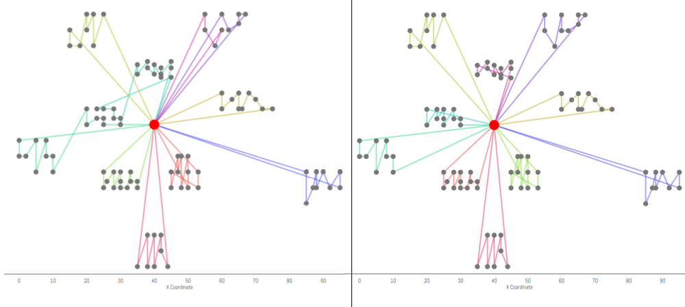

# My solution for the Coursera course "Discrete Optimization"

This repo contains solutions for 5 homework assignments of ["Discrete Optimization" on Coursera by Professor Pascal Van Hentenryck](https://www.coursera.org/learn/discrete-optimization). The implementation of the solver is written in Java, though the course itself uses Python to submit the solution.

## Table of contents
1. [Knapsack](#Chapter1)
2. [Coloring](#Chapter2)
3. [Traveling Salesman Problem](#Chapter3)
4. [Facility](#Chapter4)
5. [Vehicle Routing](#Chapter5)

<a name="Chapter1"></a>
## Knapsack
[Description](./knapsack/handout.pdf)

This problem is non-trivial. Even if you can solve it using dynamic programming, it will deplete the memory when the input scale is large. Here I used heuristic search to get the solution.

First, we sort the items by "value per weight". This pushes our solver closer to the global optimum, which will generate a useful **bounding** at an early stage. It also makes it easier for us to compute the bounding.

The bounding here means the largest possible value we can get by seleting a subset of the items, even with some relaxation of the condition. Thus the bounding is the upper bound of the value we can get under a certain configuration, but not the supremum of that. Here when we are computing the bounding, we assume we can get a fraction of each item. In fact, using a greedy strategy, only the item with the lowest "value per weight" will be chosen partially.

Then, we begin searching the solution space. This process is similar to seaching a tree. At each node, we determine whether or not to add the item to the knapsack. When the current bounding is worse than the best solution we get so far, we prune the tree and backtrack. Below is an example showing the process of the search.


<a name="Chapter2"></a>
## Coloring
[Description](./coloring/handout.pdf)

This problem is a little bit tricky. I tried exhaustive search with early termination but scored only 45 out of 60. I then referenced the solution from https://github.com/kouei/discrete-optimization/tree/master/coloring and used local search to get a very good solution.

The search process begins with a random assignment of n colors to these n nodes. We will gradually remove color from the setting and check whether this can be made feasible. After hitting some limit we will output the current feasible color number as the objective.

In the core of the search process, we will try to color the graph with n nodes. We will select the node with the most violation with its neighbors, and then change its color to obtain the least violation with neighbors.

Another key point is that we are using **Tabu Search**. The nodes in Tabu will temporarily not be considered when we want to change the color of a node.

<a name="Chapter3"></a>
## Traveling Salesman Problem
[Description](./tsp/handout.pdf)

I scored 42 out of 60 for this assignment.

I implemented **k-opt**, a local search operation for this problem. When we evaluate an edge, we will find that for some node if we connect it to another node and recover the path, the total distance will decrease. We can keep doing this for several times(which is known as k-opt) and track the maximum decrease in distance we can achieve. This operation will potentially break the cross lines in the path. I also added Tabu to prevent the algorithm from getting stuck in local optima. Below is a visualization of a solution.


<a name="Chapter4"></a>
## Facility
[Description](./facility/handout.pdf)

I scored 57 out of 80 for this assignment. I also referenced some ideas from https://github.com/kouei/discrete-optimization/tree/master/facility.

I used Mixed Integer Programming to solve this problem and I chose Google OR Tools as the 3rd party library. When compiling the Java file, make sure to include .jar not only in the compile time, but also in runtime. For example, in solver.py, run the Java program as such:

```
process = Popen(['java', '-cp', '\".;D:/OrToolGoogle/or-tools_VisualStudio2019-64bit_v7.7.7810/lib/com.google.ortools.jar;D:/OrToolGoogle/or-tools_VisualStudio2019-64bit_v7.7.7810/lib/protobuf.jar\"', 'Solver', '-file=' + tmp_file_name], stdout=PIPE, universal_newlines=True)
```

and when compiling, add the same dependencies as well:

```
> javac -cp ".;D:/OrToolGoogle/or-tools_VisualStudio2019-64bit_v7.7.7810/lib/com.google.ortools.jar;D:/OrToolGoogle/or-tools_VisualStudio2019-64bit_v7.7.7810/lib/protobuf.jar" Solver.java
```

When the input scale is relatively small, I will solve the problem directly using MIP.

When the input scale is large, I will begin with a greedy solution and then refine the solution using MIP gradually. At each step, we pick a random facility, its neighborhood (nearest N facility and customers they are serving) forms a sub-problem. We then use MIP to solve the sub-problem until we hit some limit for our steps.

<a name="Chapter5"></a>
## Vehicle Routing
[Description](./vrp/handout.pdf)

I scored 45 out of 60. This problem is very tricky, it's like that you get tangled under the constraints and can hardly move forward. Ultimately I just came up with a method which produces good solutions but not perfect ones. However, this method runs quickly and generates solutions within a minute.

I did get inspirations from this problem shown below.


I noticed that some customers are somewhat *clustered* to some extent. So I cannot help considering using a k-means algorithm to find these potential clusters of data. Because each vehicle will visit the depot, I modified the algorithm and offsetted the centroid of each cluster by always adding the depot's position to the sum of customer positions of that cluster. The effectiveness of this modification can be seen below.

 

This works pretty well! And this first step helps us preserve the **geographic local structure** of the data.

Now that we have an initial state of our solver, we will need to consider two things, which is very tricky to address.

The first is that we will need to break the violations, otherwise the solution will be useless.

The second is that we want to reduce the distance that our vehicles need to travel to visit each customer.

It is very hard to say which one should be done first, or how should we iterate through this process until we find a good solution.

Here I used local search to build the high level logic. We can perform 3 types of local move, which is "k-opt", "relocate" and "exchange". Then I combined the feasibility of the solution and the cost of the solution into one single score using a simple formula:

```
score = violationImprovement / averageDemand - u * distancePenalty / distantLength
```

"averageDemand" is the mean of all customers' demands and "distantLength" is the largest distance between any two points. "violationImprovement" is the reduction of violation after a local move operation and "distancePenalty" is the increase in total distance(cost) after that operation.

In the formula, u is used to scale the contribution of the distance penalty to the score of that operation. If we cannot find positive score, it means we have to compromise longer travel distance to make the solution feasible. So if that happens, the algorithm reduces u gradually.

Honestly I did not expect this works but it actually does! Even though the solution is not perfect, it can be got very quickly. This also marks the completion of my "Discrete Optimization" on Coursera. It's not easy, but is worth it!


